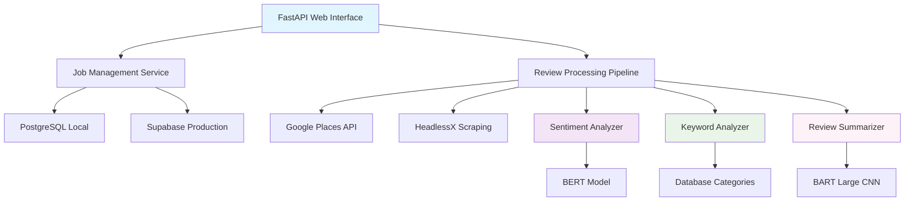

# Opinator - Intelligent Review Analysis Platform

A comprehensive FastAPI-based platform for scraping, analyzing, and categorizing reviews from multiple sources with AI-powered sentiment analysis and multilingual keyword extraction.

## 🚀 Features

### **Hybrid Data Acquisition**
- **Official APIs**: Google Places API for fast, reliable reviews
- **Web Scraping**: HeadlessX with 40+ anti-detection techniques
- **Dual Search Methods**: Keyword-based search or direct URL scraping

### **AI-Powered Analysis**
- **Sentiment Analysis**: Real-time emotion detection with confidence scoring
- **Keyword Extraction**: Database-driven multilingual keyword categorization
- **AI Summarization**: BART-powered automatic summaries for long reviews (>150 chars)
- **Statistical Insights**: Comprehensive sentiment distribution and category analysis
- **Language Detection**: Automatic language identification (English, Spanish, French)

### **Production-Ready Architecture**
- **Dual Database Support**: PostgreSQL (local dev) + Supabase (production)
- **Environment Flexibility**: Seamless switching between local/production
- **Admin Panel**: Keyword category management with multilingual support
- **Modern UI**: Responsive web interface with real-time updates

### **Platform Support**
| Platform | Method | Status | Features |
|----------|--------|--------|----------|
| **Google Reviews** | Places API | ✅ Active | Fast, reliable, 5 reviews/place |
| **TripAdvisor** | Web Scraping | 🚧 Planned | Full scraping capability |
| **Booking.com** | Web Scraping | 🚧 Planned | Full scraping capability |

## 📋 Prerequisites

- **Python 3.12+**
- **Docker & Docker Compose**
- **PostgreSQL** (for local development)
- **Supabase Account** (for production deployment)
- **Google Cloud Account** (for Google Places API)
- **~1GB RAM** (for AI models)

## 🛠 Quick Setup

### 1. Clone Repository
```bash
git clone <your-repo-url>
cd opinator
```

### 2. Clone HeadlessX (Required)
```bash
# This is mandatory - the app won't work without it
git clone https://github.com/saifyxpro/HeadlessX.git
```

### 3. Environment Configuration
```bash
cp .env.example .env
# Edit .env with your configuration
```

### 4. Choose Your Environment

#### **Local Development** (PostgreSQL)
```bash
# Set environment to local
echo "FASTAPI_ENV=local" > .env

# Start services
docker compose -f docker/docker-compose.dev.yml up -d

# Start FastAPI (in virtual environment)
python -m venv .venv
source .venv/bin/activate  # Linux/Mac
# or .venv\Scripts\activate  # Windows
pip install -r requirements.txt
python -m uvicorn app.main:app --host 0.0.0.0 --port 8001 --reload
```

#### **Production** (Supabase)
```bash
# Set environment to production
echo "FASTAPI_ENV=production" > .env

# Configure Supabase credentials in .env
SUPABASE_URL=https://your-project.supabase.co
SUPABASE_KEY=your_service_key_here

# Start application
python -m uvicorn app.main:app --host 0.0.0.0 --port 8001
```

## 🏗 Architecture



## 🔧 Configuration

### **Environment Variables**

#### **Core Settings**
```bash
FASTAPI_ENV=local                    # or 'production'
HEADLESSX_URL=http://localhost:3001
MAX_REVIEWS_PER_PLATFORM=25
DEBUG=true
```

#### **PostgreSQL (Local Development)**
```bash
POSTGRES_HOST=localhost
POSTGRES_PORT=5435
POSTGRES_DB=opinator
POSTGRES_USER=opinator
POSTGRES_PASSWORD=opinator123
```

#### **Supabase (Production)**
```bash
SUPABASE_URL=https://your-project.supabase.co
SUPABASE_KEY=your_service_key_here
```

#### **External APIs**
```bash
GOOGLE_PLACES_API_KEY=your_google_api_key
AUTH_TOKEN=your_headlessx_auth_token
```

### **Google Places API Setup**

1. **Create Google Cloud Project**
   - Visit [Google Cloud Console](https://console.cloud.google.com/)
   - Create new project

2. **Enable Places API**
   - Go to "APIs & Services" > "Library"
   - Search and enable "Places API"

3. **Generate API Key**
   - Navigate to "Credentials" > "Create Credentials"
   - Copy API key to `.env`

## 🤖 AI Analysis Features

### **Sentiment Analysis**
- **Model**: `finiteautomata/bertweet-base-sentiment-analysis`
- **Classifications**: Positive 😊, Negative 😞, Neutral 😐
- **Real-time Processing**: Analyzes reviews as they're scraped
- **Confidence Scoring**: Percentage confidence for each prediction
- **Visual Indicators**: Color-coded review cards and summary statistics

### **Keyword Analysis**
- **Database-Driven**: 12 predefined categories with 65+ keywords
- **Multilingual**: English, Spanish, French support
- **Categories**: Parking, Pets, Location, Cleanliness, Facilities, etc.
- **Admin Management**: Add/edit keywords via web interface
- **Automatic Detection**: Language-aware keyword matching

### **AI Review Summarization**
- **Model**: `facebook/bart-large-cnn` (BART Large CNN)
- **Smart Processing**: Only summarizes reviews longer than 150 characters
- **Concise Output**: Generates 30-100 character summaries
- **Key Points Extraction**: Identifies main issues and highlights from long reviews
- **Real-time Generation**: Summaries created during the scraping process
- **Visual Integration**: Displayed with distinctive robot icon 🤖 in blue highlight boxes
- **Database Storage**: Summaries saved for future reference and analytics

### **Supported Categories**
| Category | Icon | Languages | Keywords |
|----------|------|-----------|----------|
| Parking | 🚗 | EN/ES/FR | parking, estacionamiento, parking |
| Pets | 🐕 | EN/ES/FR | dog, perro, chien, pet, mascota |
| Location | 📍 | EN/ES/FR | location, ubicación, près, cerca |
| Cleanliness | 🧹 | EN/ES/FR | clean, limpio, propre, dirty, sucio |
| Internet | 📶 | EN/ES/FR | wifi, internet |
| Beach & Nature | 🏖️ | EN/ES/FR | beach, playa, plage, sea, mar |
| ... | ... | ... | *And 6 more categories* |

## 📊 Database Schema

### **Dual Database Support**

#### **PostgreSQL Tables (Local)**
- `scraping_jobs` - Job tracking with statistics
- `reviews` - Review data with sentiment/keywords/summaries
- `keyword_categories` - Category definitions
- `category_keywords` - Multilingual keyword mappings

#### **Supabase Tables (Production)**
- Same schema with automatic date string conversion
- Optimized queries for Supabase limitations
- Real-time data synchronization

## 🖥 Web Interface

### **Main Features**
- **Dashboard**: Overview with job statistics and recent activities
- **Search Interface**: Keyword or URL-based search with platform selection
- **Job Details**: Comprehensive review analysis with sentiment/keyword/summary breakdown
- **Admin Panel**: Keyword category management
- **History**: Complete job history with filtering

### **Pages**
- `/` - Dashboard with statistics
- `/search` - Create new scraping jobs
- `/job/{id}` - Detailed job results
- `/history` - Job history
- `/admin/keywords` - Keyword management

## 📱 API Endpoints

### **Core Operations**
```python
# Start scraping job
POST /scrape
{
    "search_type": "keyword",
    "search_query": "Hotel Barcelona",
    "platforms": ["google"]
}

# Get job details
GET /job/{job_id}

# Latest job status
GET /api/latest-job-status

# Dashboard statistics
GET /api/dashboard-stats
```

### **Admin Operations**
```python
# Get all keyword categories
GET /admin/api/categories

# Add keyword to category
POST /admin/api/categories/{category}/keywords
{
    "keyword": "lejos",
    "language": "es",
    "weight": 1.0
}
```

## 🐳 Docker Deployment

### **Development Setup**
```bash
# Start PostgreSQL + HeadlessX
docker compose -f docker/docker-compose.dev.yml up -d

# Run FastAPI locally with hot reload
source .venv/bin/activate
python -m uvicorn app.main:app --host 0.0.0.0 --port 8001 --reload
```

### **Production Setup**
```bash
# Full containerized deployment
docker compose -f docker/docker-compose.prod.yml up -d
```

## 🔍 Usage Examples

### **Web Interface**
1. Visit `http://localhost:8001`
2. Click "New Search"
3. Enter: "HolaCamp Barcelona"
4. Select platforms: Google Reviews
5. Click "Start Scraping"
6. View results with sentiment analysis

### **API Usage**
```python
import httpx

# Create scraping job
response = httpx.post("http://localhost:8001/scrape", data={
    "search_type": "keyword",
    "search_query": "Hotel Barcelona",
    "platforms": ["google"]
})

# Get results
job_id = response.headers.get("location").split("/")[-1]
results = httpx.get(f"http://localhost:8001/job/{job_id}")
```

## 🎯 Performance & Scalability

### **Processing Speed**
- **Google API**: ~1-2 seconds for 5 reviews
- **Sentiment Analysis**: ~1-2 seconds per review batch
- **Keyword Analysis**: Real-time database matching
- **AI Summarization**: ~2-3 seconds per long review (model loads once)
- **Database**: Optimized queries with proper indexing

### **Resource Usage**
- **Memory**: ~1GB (AI models including BART Large CNN)
- **Storage**: ~100MB per 1000 reviews (+ summaries)
- **CPU**: Moderate during analysis, idle otherwise
- **Model Loading**: BART loads on first use, cached for session

## 🚨 Troubleshooting

### **Common Issues**

1. **Database Connection Failed**
   ```bash
   # Check environment
   echo $FASTAPI_ENV

   # Verify PostgreSQL (local)
   docker compose -f docker/docker-compose.dev.yml ps

   # Test Supabase connection (production)
   curl -H "apikey: YOUR_KEY" https://your-project.supabase.co/rest/v1/
   ```

2. **HeadlessX Not Found**
   ```bash
   # Ensure HeadlessX is cloned
   ls -la HeadlessX/

   # Re-clone if missing
   git clone https://github.com/saifyxpro/HeadlessX.git
   ```

3. **Sentiment Model Download Issues**
   ```bash
   # Manual model download
   python -c "from transformers import pipeline; pipeline('sentiment-analysis')"
   ```

4. **Job Shows 'Not Found'**
   - Check `FASTAPI_ENV` matches your database setup
   - Verify job ID exists in correct database
   - Check logs for processing errors

## 🔒 Security Notes

- **API Keys**: Never commit real API keys to version control
- **Database**: Use strong passwords in production
- **HeadlessX**: Configure proper authentication tokens
- **Supabase**: Use service keys, not anonymous keys

## 🚀 Deployment

### **Local Development**
Perfect for development and testing with full PostgreSQL features.

### **Production (Supabase)**
Recommended for production with managed database, automatic backups, and scalability.

### **Environment Switching**
Simply change `FASTAPI_ENV=local` or `FASTAPI_ENV=production` in `.env` and restart.

## 📈 Roadmap

- [ ] **Additional Platforms**: TripAdvisor, Booking.com scraping
- [ ] **Advanced Analytics**: Trend analysis, comparative insights
- [ ] **Export Features**: PDF reports, CSV exports
- [ ] **Real-time Updates**: WebSocket-based live updates
- [ ] **User Management**: Multi-user support with authentication
- [ ] **API Rate Limiting**: Enhanced API security and quotas

## 🙏 Acknowledgments

- **[HeadlessX](https://github.com/saifyxpro/HeadlessX)** - Advanced web scraping engine
- **[FastAPI](https://fastapi.tiangolo.com/)** - Modern Python web framework
- **[Supabase](https://supabase.com/)** - Open-source Firebase alternative
- **[HuggingFace](https://huggingface.co/)** - Transformer models for AI analysis
- **[Tailwind CSS](https://tailwindcss.com/)** - Utility-first CSS framework

---

**Made with ❤️ for intelligent review analysis**